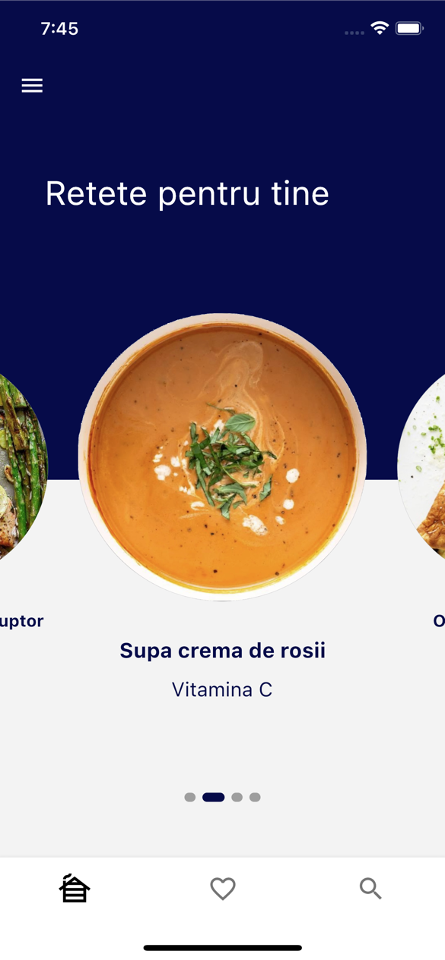
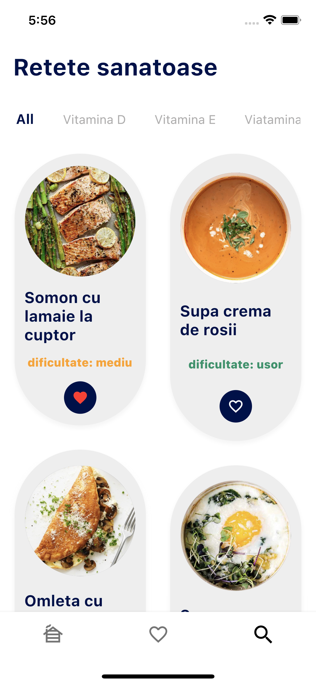
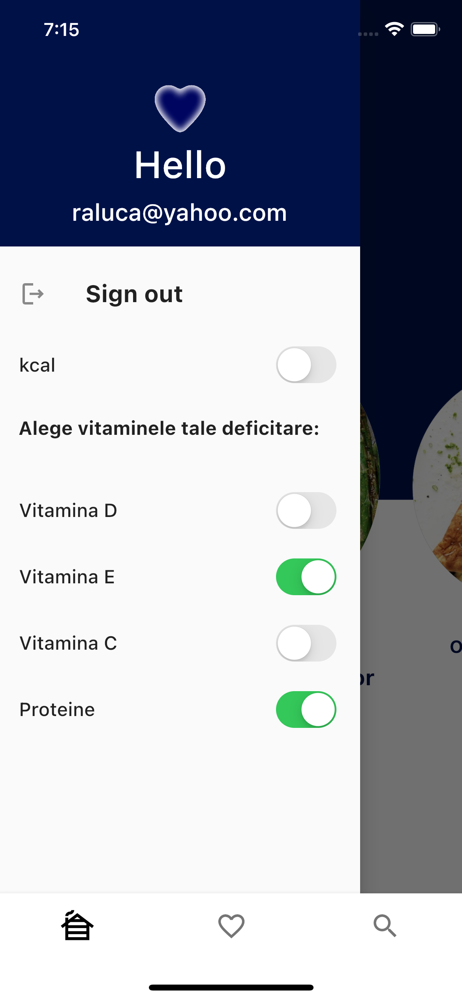

# Your healthy meal - winner of a 24-hour hackathon

#### An app that assists in correcting vitamin deficiencies by offering personalized recipe suggestions based on each user's profile.

## Description

The application is customizable to suit the user's needs. The user will configure their profile by selecting the deficient vitamins, and based on the chosen options, they will receive recipe recommendations, which can be added to a favorites section. The recipes are sorted by difficulty level and have the option to hide the number of calories for users who suffer from eating disorders.

The app is cross-platform and has a responsive & adaptive UI.

### UI

  
   
  

## Tech Stack

* Flutter Framework
* Firebase 

## Dependencies

  * [cupertino_icons](https://pub.dev/packages/cupertino_icons)
  * [material_design_icons_flutter](https://pub.dev/packages/material_design_icons_flutter)
  * [page_transition](https://pub.dev/packages/page_transition)
  * [firebase_core](https://pub.dev/packages/firebase_core)
  * [equatable](https://pub.dev/packages/equatable)
  * [cloud_firestore](https://pub.dev/packages/cloud_firestore)
  * [firebase_auth](https://pub.dev/packages/firebase_auth)
  * [another_flushbar](https://pub.dev/packages/another_flushbar)
  * [top_snackbar_flutter](https://pub.dev/packages/top_snackbar_flutter)
  * [email_validator](https://pub.dev/packages/email_validator)
